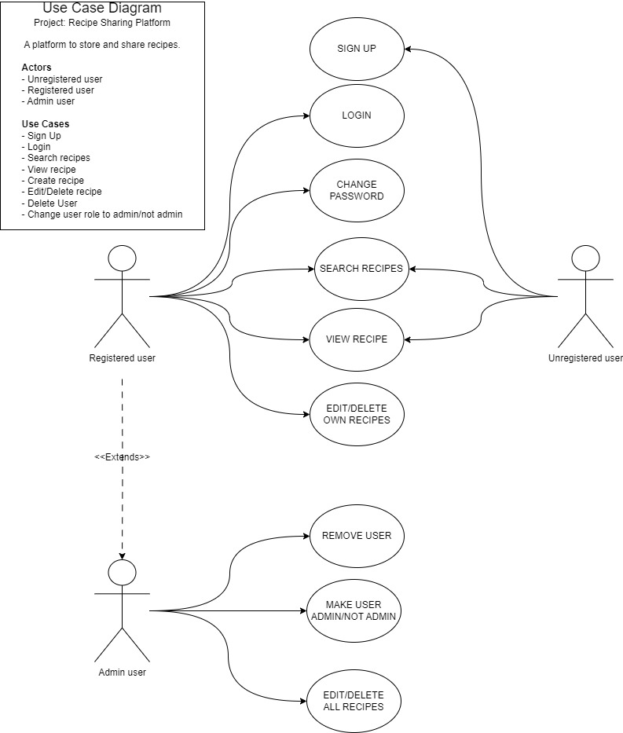
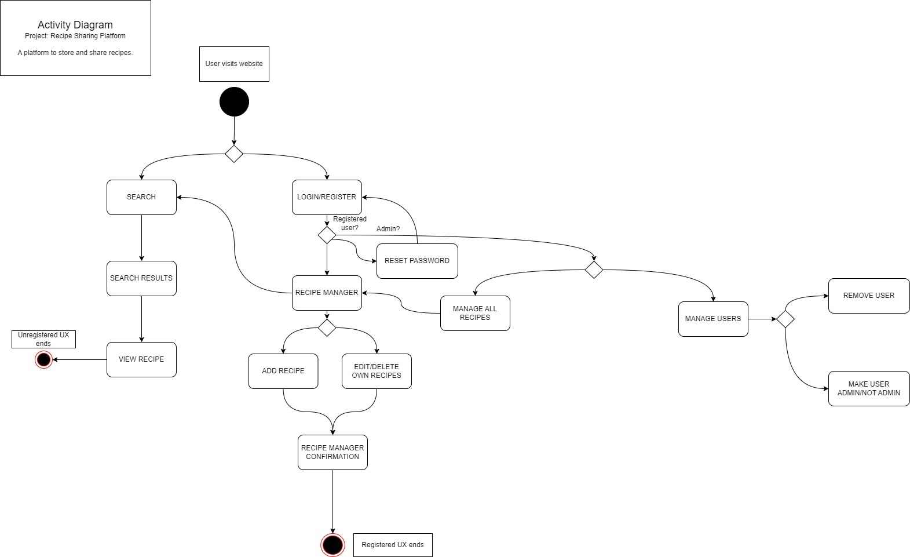
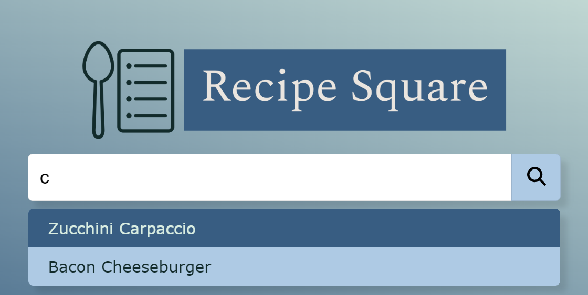

# Recipe Square

This is my capstone project for the Full Stack Development course at devCamp by Bottega University.

The project requirements are detailed [here](https://docs.google.com/document/d/1bl2WmSxxoV-xorV7Emk6aKXvZbjnzASr/edit#heading=h.gjdgxs).

## Description

Recipe Square is a place to easily store and share recipes with family and friends.

[URL for deployed frontend](https://recipe-square-frontend-5c021339c6db.herokuapp.com/)

[URL for deployed backend](https://recipe-square-backend-f76d80c4c9fc.herokuapp.com/)

## Applications and languages used

- **Frontend**: React (with Axios for API calls).
- **Backend**: Python with Flask (MongoDB for data storage).
- **Microservices**: Separate services for recipe management, user authentication and password recovery, user and recipe management.
- **New Feature** learnt on this project: Search bar.
- **Deployment service**: Heroku (for frontend and backend), MongoDB Cloud Atlas (for the DB) and Cloudinary (for recipe image storage)

## User Stories

- User Story 1: Any unregistered user can view and search recipes.
- User Story 2: A registered user can create, view and search recipes.
- User Story 3: An admin user can do the same as an authenticated user plus manage all users and recipes.




## Activity Diagram




## Description the self-taught feature (search bar)

The idea was to create an intuitive search bar, like the one used in most search engines.
When the user types something, the recipes collection is searched and a list of suggestions is displayed below the search bar. The user can then either click on any of the suggestions to display the recipe, or press Enter (or click the magnifying glass) to display the list of suggestions in a new page, where he can see the recipe title and its associated image, and access the recipes from there.




### Files involved in this feature

**Searchbar.jsx**

Main component. I’ve used react-hook-form to retrieve the input from the user (stored in the variable searchKey), which triggers a search in the DB by recipe title using the useEffect hook (backend # API endpoint 13 ). The recovered recipes are added to a suggestions array and passed to the SearchSuggestionsList component. On submit, the form navigates to the Results component, passing the searchKey variable.

**Search-suggestions-list.jsx**

Receives the suggestions array and maps it into SearchSuggestion components, passing to each of them their title and id. Its mission is to display the suggestions below the searchbar.

**Search-suggestion.jsx**

Renders each individual suggestion of the SearchSuggestionsList component. It displays the suggestion title and, when clicked, it navigates to the individual recipe (Recipe.jsx component), sending the suggestion id to retrieve it from the DB.


**Results.jsx**

This component is rendered when the user presses Enter or clicks on the magnifying glass of the search bar without selecting any of the suggested recipes. It receives the searchKey from the Searchbar.jsx onSubmit function, searches the recipes in the DB and maps the received recipes array into ResultItem components, passing to each of them the id, title and image.

**Result-item.jsx**

Renders each individual recipe in the results page, displaying its title and image (if there’s any) or a placeholder image if there is no image in the DB for the recipe. When the user clicks on this component, it navigates to the individual recipe (Recipe.jsx component), sending the recipe id to retrieve it from the DB.


## Frontend structure


```bash
recipe-square-frontend/
│
├── public/                 
│   ├── favicon.ico                           # Project icon
│   └── logo-transparent.png                  # Project logo
├── src/                 
│   ├── components/
│   │     ├── auth/                           # Authorization-related files 
│   │     │   ├── Auth-form.jsx
│   │     │   └── AuthContext.jsx
│   │     ├── pages/                          # Page components
│   │     │   ├── Admin-dashboard.jsx
│   │     │   ├── Home.jsx
│   │     │   ├── Login.jsx
│   │     │   ├── No-page.jsx
│   │     │   ├── Recipe-form.jsx
│   │     │   ├── Recipe-manager.jsx
│   │     │   ├── Recipe.jsx
│   │     │   ├── Request-password-reset.jsx
│   │     │   ├── Reset-password.jsx
│   │     │   ├── Results.jsx
│   │     │   ├── Search-suggestion.jsx
│   │     │   ├── Search-suggestions-list.jsx
│   │     │   └── Signup.jsx
│   │     ├── recipe/                         # Recipe-related components
│   │     │   ├── Recipe-card.jsx
│   │     │   ├── Recipe-container.jsx
│   │     │   └── Recipe-item.jsx
│   │     ├── search/                         # Search-related components
│   │     │   ├── Result-item.jsx
│   │     │   ├── Searchbar.jsx
│   │     ├── Navbar.jsx                    # Navigation bar component
│   │     └── User-card.jsx                 # User card component
│   ├── helpers/                            # Helper files
│   │     ├── API.jsx
│   │     └── Icons.jsx     
│   ├── style/                              # Styling files
│   │     ├── base/                         # Base styles
│   │     │   ├── colors&variables.scss
│   │     │   ├── generic.scss
│   │     │   └── mixins.scss
│   │     ├── components/                   # Component-specific styles
│   │     │     ├── auth/
│   │     │     │   └── auth-form.scss
│   │     │     ├── pages/
│   │     │     │   ├── admin-dashboard.scss
│   │     │     │   ├── home.scss
│   │     │     │   ├── recipe-form.scss
│   │     │     │   ├── recipe.scss
│   │     │     │   └── reset-password.scss
│   │     │     ├── recipe/
│   │     │     │   ├── recipe-card.scss
│   │     │     │   ├── recipe-container.scss
│   │     │     │   └── recipe-item.scss
│   │     │     ├── search/
│   │     │     │   ├── result-item.scss
│   │     │     │   ├── search-suggestion.scss
│   │     │     │   ├── search-suggestions-list.scss
│   │     │     │   └── searchbar.scss
│   │     │     ├── navbar.scss               # Navbar-specific styles
│   │     │     ├── react-draft-wysiwyg.scss  # WYSIWYG editor styles
│   │     │     └── user-card.scss            # User card-specific styles
│   │     └── main.scss                       # Main global styles
│   ├── App.jsx                               # App file
│   └── main.jsx                              # Entry point file
│
├── .gitignore                                # Git ignore file
├── readme.md                                 # Project structure
├── eslint.config                             # Linting configuration
├── index.html                                # Main HTML file
├── package-lock.json                         # Dependencies
├── package.json                              # Dependencies
└── vite.config.js                            # Vite configuration

```

## Backend repository

The backend repository for this project can be found [here](https://github.com/pedromorenovillar/recipe-square-backend?tab=readme-ov-file).

## Future improvements

- Implement language selection
- Add Spanish version
- Polish UI (simplifying the colors and differenciating the UI parts)
- Add commenting feature
- Add rating feature
